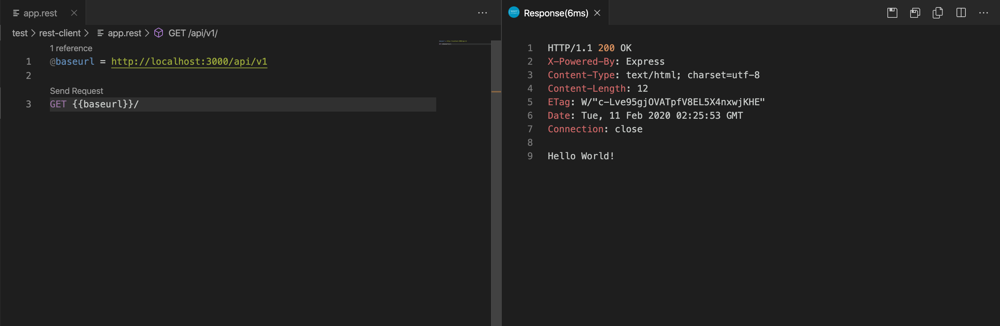

# REST API Testing Powered by REST Client
> Install REST Client extension in VSCode to run the test. Nevertheless, this folder is still a good reference to all available api enpoints.

1. create a text file, prefereably use `.http` or `.rest` as file extension for syntax highlighting.
2. write down a http request, the REST Client extension should be able to recognize it and show a `Send Request` button above it.
3. Click it, the response will show up in a split pane.

